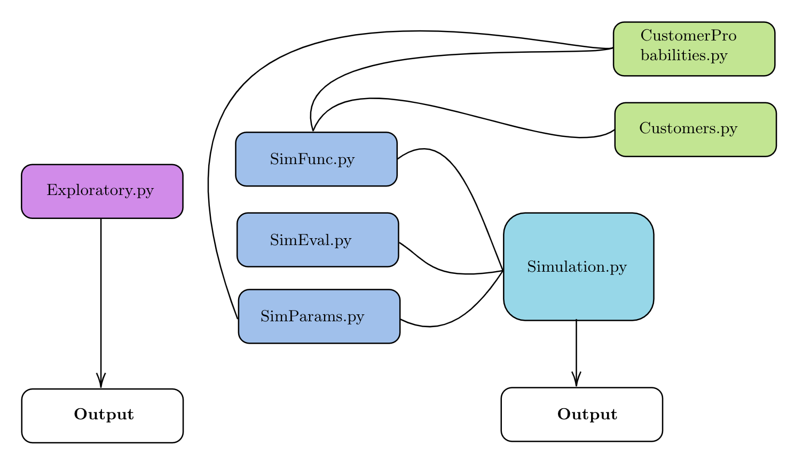

# Simulating a Coffee Shop

This project simulates customers visiting a coffee shop over a time span of 5 years. The following assumptions are made:

* The simulation is one-dimensional, i.e. we model a single coffee shop that is visited by different types of customers. 
The coffee shop does not observe any change in variables apart from a possible change in menu prices. 

* The coffee shop operates in discrete time intervals and each is filled by one single customer. 

* Customers make their purchase choice based on a fixed probability which stems from analyzing empirical data. 

* There are four types of customers that differ in their behavior and attributes:
    * One time customers
    * Customers coming from trip advisor
    * Returning Customers
    * Hipsters

* The number of returning customer is determined at t=0 and only changes if returning customers are no longer able to
jointly purchase the most expensive drink and food. 

## Getting Started

You are already reading the READ ME, so well done, the hardest part is behind you! In case you have not yet cloned the repository, please navigate to
https://bitbucket.org/aboomer07/examtse2020-21/src/master/ and clone the repository to your local machine.

### Prerequisites

* Python 3.8 up and running, preferably via anaconda. 

Non-standard libraries might have to be installed prior to executing the program: 

* uuid (pip install uuid)

* names (sudo pip install names)

* objgraph and graphviz (pip install objgraph, pip install graphviz) - these libraries are only necessary if you want to
conduct meta analysis on the objects used in the simulation! 

## Code Structure
The file structure is visualized below. Importantly, the scripts should be used as follows: 

* Executing _Exploratory.py_ prints basic summaries about the input data to the console and returns a set of plots
illustrating the data at hand. These plots are stored in the _Output_ folder, which will be automatically added to your
directory, if not already present.

* Executing _Simulation.py_ runs the actual simulation and executes a set of functions to evaluate the simulated process
(see section below for further details). Plots are again stored in _Output_.

* _SimParams.py_ allows you to change the input variables of the simulation. 

The remaining scripts can be interpreted as the back end and should only be changed if you want to fundamentally change
the simulation:

* _SimFunc.py_ contains the simulating function.

* _SimEval.py_ contains functions to evaluate and store the simulated process.

* Customer classes used in the simulated are defined in _Customers.py_. 

* _CustomerProbabilities.py_ calculates time dependent purchase probabilities from empirical input data. 




## Navigating the simulation

_Simulation.py_ offers the possibility to easily run different simulations and evaluate them. Use the functions
described below to investigate your different simulation runs.

### Evaluating the simulation

The simulated process can be evaluated via two functions: 
``` 
showcase_sim(sim, params, n_example) 
```
Takes in the simulated data frame, it's underlying parameters and the number of examples that should be shown.
Returns _n_example_ randomly selected simulated customers and showcases their functionality and purchasing history.

``` 
plot_sim(sim, ind) 
```

Takes as arguments the simulated data frame and and a string indicator to name the resulting plots (e.g. 'sim_1').
Returns a set of plots to evaluate the simulation and compare simulation runs.

### Storing the simulation
```
store_sim(sim, ind)
```
Exports the simulated data as a csv file to your output folder.

## Versioning

We use bitbucket to version the code. Prior commits can be obtained from 
https://bitbucket.org/aboomer07/examtse2020-21/commits/.


## Authors

* **Andy Boomer** - _Toulouse School of Economics_

* **Jacob Pichelmann** - _Toulouse School of Economics_

## Acknowledgments

A heartfelt 'thank you' to all people who contribute to https://stackoverflow.com/.
