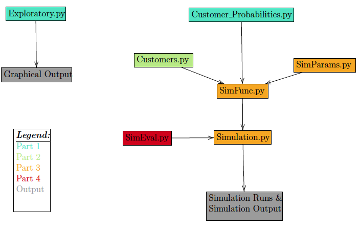

# Simulating a Coffee Shop

This project simulates customers visiting a coffee shop over a time span of 5 years, based on empirical input data.

## Getting Started

You can already read the READ ME, so well done, the hardest part is behind you! In case you have not yet cloned the repository, please navigate to
https://bitbucket.org/aboomer07/examtse2020-21/src/master/ and clone the repository to your local machine.

### Prerequisites

* Python 3.8 up and running, preferably via anaconda. 
Non-standard libraries might have to be installed prior to executing the program: 
* uuid (pip install uuid)
* names (sudo pip install names)

## Code Structure

## Running tests

Explain how to run the automated tests for this system

## Versioning

We use [SemVer](http://semver.org/) for versioning. For the versions available, see the [tags on this repository](https://github.com/your/project/tags). 

## Authors

* **Andy Boomer**

* **Jacob Pichelmann**

## License

This project is licensed under the MIT License - see the [LICENSE.md](LICENSE.md) file for details

## Acknowledgments

* Hat tip to anyone whose code was used
* Inspiration
* etc
